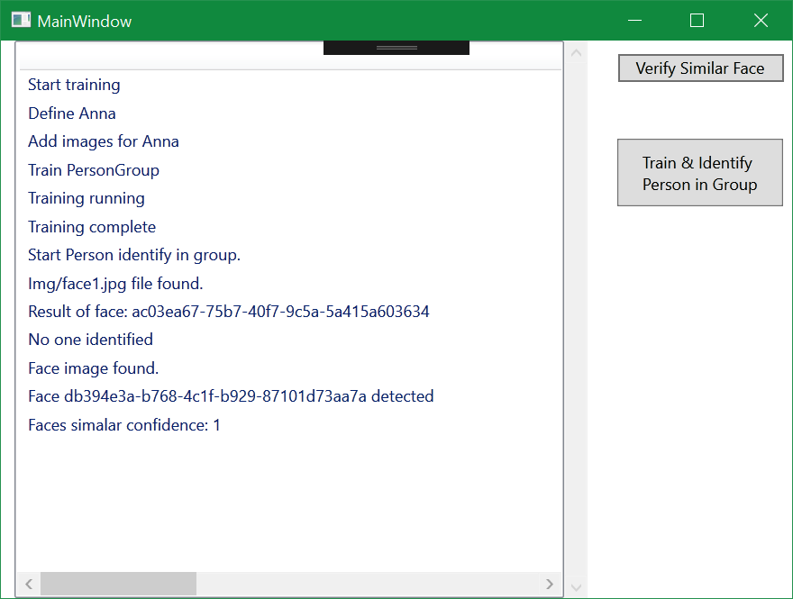

# Face-Person-Identify

 

You must set the Face resource key from the portal.azure.com to the app.config in the value tag of the Key setting.
 
  &#x3C;userSettings&#x3E; 
    &#x3C;Face.Properties.Settings&#x3E; 
      &#x3C;setting name=&#x22;Key&#x22; serializeAs=&#x22;String&#x22;&#x3E; 
        &#x3C;value&#x3E;&#x3C;/value&#x3E; 
      &#x3C;/setting&#x3E; 
    &#x3C;/Face.Properties.Settings&#x3E; 
&#x3C;/userSettings&#x3E; 
The current endpoint is set to westus, so the key should match this region. 
You can change the endpoint here: 
      public partial class MainWindow : Window 
    { 
        private const string endPoint = @"https://westus.api.cognitive.microsoft.com/"; 
See https://docs.microsoft.com/en-us/azure/cognitive-services/cognitive-services-apis-create-account if you don't have a Face API account yet. 
 
